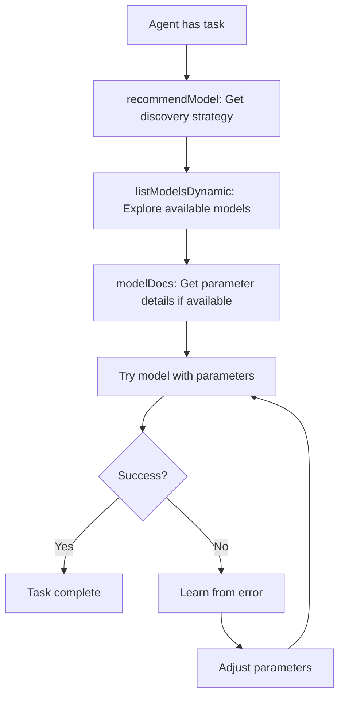

# fal-mcp Architecture & Philosophy

## Core Philosophy: Discovery Over Prescription

The fal-mcp project embraces a fundamental principle: **agents should discover capabilities through exploration, not follow hardcoded rules**. This approach ensures the toolset remains evergreen, automatically supporting new models as they're released without requiring code updates.

## Key Architectural Decisions

### 1. No Model-Specific Logic

We explicitly avoid patterns like:

```typescript
// ❌ NEVER DO THIS
if (model.includes("whisper")) {
  input.return_timestamps = true;
} else {
  input.include_timestamps = true;
}
```

Instead, we embrace uncertainty:

```typescript
// ✅ DO THIS
const input = {
  ...parameters,
  // Try multiple parameter names - let the API guide us
  return_timestamps: includeTimestamps,
  include_timestamps: includeTimestamps,
  timestamps: includeTimestamps,
};
```

### 2. Generic Parameter Passing

Every tool accepts a `parameters` object that passes through ANY parameters the agent wants to try:

```typescript
export const schema = {
  prompt: z.string().describe("Text description"),
  model: z.string().describe("Any fal-ai model ID"),
  parameters: z.record(z.any()).optional()
    .describe("Additional model-specific parameters - experiment freely"),
};
```

This design enables:

- Immediate support for new models
- Agent learning through experimentation
- No maintenance burden when APIs evolve

### 3. Documentation as Discovery Aid

Rather than hardcoding model knowledge, we provide tools for agents to learn:

#### modelDocs Tool

Provides detailed parameter documentation when available:

```typescript
// Agent can request: modelDocs({ modelId: "fal-ai/flux/dev" })
// Returns: Detailed parameter specs, examples, tips
```

#### recommendModel Tool

Offers discovery strategies, not prescriptive lists:

```typescript
// Instead of: "Use model X for task Y"
// We say: "Here's how to discover what works for your task"
```

## The Discovery Flow



## Benefits of This Approach

### 1. Zero Maintenance
- New models work automatically
- No code changes needed when APIs evolve
- No version dependencies on specific models

### 2. True Agent Autonomy
- Agents learn what works through experience
- Error messages become learning opportunities
- Knowledge compounds over interactions

### 3. Flexibility
- Supports any fal-ai/* model
- Handles parameter variations gracefully
- Works with experimental/beta models

### 4. Scalability
- Documentation can grow independently
- Community can contribute discoveries
- No coupling between code and model specifics

## Testing Strategy

Our testing approach mirrors the discovery philosophy:

```typescript
// Mock mode returns generic responses based on tool context
if (process.env.FAL_MCP_MOCK === 'true') {
  // Return appropriate mock based on calling tool, not model name
  return getMockResponse(model, input, toolName);
}
```

This ensures:

- Tests validate tool behavior, not model specifics
- Mock responses don't assume model patterns
- Testing remains maintainable as models evolve

## Anti-Patterns to Avoid

### ❌ Hardcoded Model Lists

```typescript
const IMAGE_MODELS = ["flux/dev", "flux/schnell", ...];
```

### ❌ Parameter Validation

```typescript
if (model === "flux/dev" && !params.image_size) {
  throw new Error("image_size required");
}
```

### ❌ Model-Specific Input Builders

```typescript
function buildFluxInput(params) { ... }
function buildWhisperInput(params) { ... }
```

### ❌ Prescriptive Recommendations

```typescript
if (task.includes("anime")) {
  return "Use model fal-ai/anime-generator";
}
```

## Design Patterns to Follow

### ✅ Parameter Discovery

```typescript
// Send multiple variations, let API choose
const input = {
  prompt,        // Some models use 'prompt'
  text: prompt,  // Others might use 'text'
  query: prompt, // Or 'query'
};
```

### ✅ Error-Driven Learning

```typescript
// Errors are expected and valuable
catch (error) {
  // Error might reveal: "Missing required parameter 'audio_url'"
  // Agent learns and retries with correct parameter
}
```

### ✅ Documentation as Resource

```typescript
// Optional documentation for agent reference
if (needsHelp) {
  const docs = await modelDocs({ modelId });
  // Agent reads and applies knowledge
}
```

### ✅ Generic Tool Design

```typescript
// Tools work with any model of their type
export default async function imageToVideo(params) {
  // No assumptions about which model or parameters
  const input = { ...parameters, image_url, image, first_frame_image };
}
```

## Future Evolution

This architecture supports future enhancements without breaking changes:

1. **Automated Documentation Generation**
   - Learn from successful API calls
   - Build parameter documentation automatically
   - Share discoveries across agents

2. **Community Knowledge Sharing**
   - Agents can contribute discovered patterns
   - Shared learning accelerates discovery
   - No code changes required

3. **Dynamic Parameter Learning**
   - Track which parameters work with which models
   - Build statistical models of likely parameters
   - Still no hardcoding - just probability

## Conclusion

The fal-mcp architecture embodies a simple principle: **empower agents to discover, don't constrain them with assumptions**. By removing all prescriptive logic and embracing dynamic discovery, we've created a toolset that:

- Works with any fal.ai model - current or future
- Requires zero maintenance as models evolve
- Enables true agent autonomy and learning
- Scales through documentation, not code changes

This is not just a technical choice - it's a philosophical stance that AI agents should be explorers, not rule followers.
